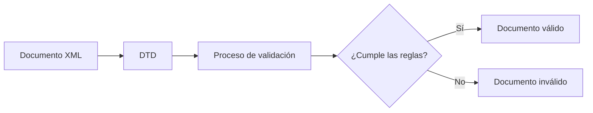

# 2. DTD: definición y uso

En el apartado anterior vimos que un documento XML puede estar perfectamente escrito y, aun así, no contener la estructura adecuada para una aplicación.

Necesitamos una forma de indicar cuáles son los elementos permitidos, cómo deben organizarse y qué reglas debe cumplir el documento.

Para ello utilizamos las DTD.

---

## 2.1 ¿Qué es una DTD?

DTD significa **Document Type Definition**.

Una DTD es un conjunto de reglas que describe la estructura que debe tener un documento XML.

Gracias a una DTD podemos definir:

- Qué elementos pueden aparecer.
- Qué elementos son obligatorios.
- En qué orden deben aparecer.
- Cuántas veces pueden repetirse.
- Qué atributos puede tener cada elemento.

!!! note "Definición"

    Una DTD actúa como un contrato que describe cómo debe construirse un documento XML válido.

---

## 2.2 ¿Por qué utilizar una DTD?

Imagina una aplicación que gestiona libros.

Todos los documentos deberían tener siempre la misma estructura:

```xml
<libro>
    <titulo>XML desde cero</titulo>
    <autor>Ana García</autor>
</libro>
```

Sin una DTD podríamos encontrar documentos diferentes:

```xml
<libro>
    <titulo>XML desde cero</titulo>
</libro>
```

o incluso:

```xml
<libro>
    <precio>29.95</precio>
</libro>
```

Ambos documentos están bien formados, pero no siguen la estructura esperada.

La DTD permite detectar automáticamente estos problemas.

---

## 2.3 Relación entre XML y DTD

Un documento XML puede asociarse a una DTD para comprobar si cumple las reglas definidas.



Cuando el analizador XML encuentra una DTD, compara la estructura real del documento con las reglas definidas en ella.

---

## 2.4 Un primer ejemplo

Observa la siguiente DTD:

```xml
<!ELEMENT libro (titulo,autor)>

<!ELEMENT titulo (#PCDATA)>

<!ELEMENT autor (#PCDATA)>
```

Esta definición indica que:

- Existe un elemento llamado `libro`.
- Todo `libro` debe contener un `titulo`.
- Todo `libro` debe contener un `autor`.
- Tanto `titulo` como `autor` contienen texto.

Por tanto, este documento será válido:

```xml
<libro>
    <titulo>XML desde cero</titulo>
    <autor>Ana García</autor>
</libro>
```

Mientras que este será inválido:

```xml
<libro>
    <titulo>XML desde cero</titulo>
</libro>
```

!!! warning "Falta un elemento"

    La DTD exige que todos los libros tengan un autor.

---

## 2.5 Ventajas de utilizar DTD

Las DTD ofrecen numerosas ventajas:

✅ Permiten validar documentos automáticamente.

✅ Garantizan estructuras homogéneas.

✅ Facilitan el intercambio de información.

✅ Ayudan a detectar errores antes de procesar los datos.

✅ Sirven como documentación de la estructura XML.

---

## 2.6 Limitaciones de las DTD

Las DTD fueron el primer sistema de validación para XML y actualmente presentan algunas limitaciones.

Por ejemplo:

- No permiten definir tipos numéricos.
- No pueden comprobar rangos de valores.
- No utilizan sintaxis XML.
- Son menos expresivas que XML Schema (XSD).

Por esta razón, en aplicaciones modernas es habitual emplear XSD.

!!! info "Más adelante"

    En la siguiente unidad estudiaremos XML Schema (XSD), una tecnología mucho más potente para la validación de documentos XML.

---

## 2.7 Cuándo utilizar una DTD

Una DTD suele utilizarse cuando:

- La estructura es relativamente sencilla.
- Se necesita compatibilidad con sistemas antiguos.
- Se trabaja con estándares XML clásicos.
- Se desea aprender los fundamentos de la validación XML.

Durante esta unidad utilizaremos DTD para comprender los conceptos que posteriormente aplicaremos con XML Schema.

---

## Actividad de reflexión

!!! question "Analiza"

    Observa el siguiente documento XML:

    ```xml
    <pelicula>
        <titulo>Blade Runner</titulo>
        <director>Ridley Scott</director>
    </pelicula>
    ```

    Si fueras el diseñador de la aplicación, ¿qué otras reglas añadirías mediante una DTD?

??? tip "Posibles respuestas"

    Algunas opciones podrían ser:

    - Año de estreno obligatorio.
    - Género cinematográfico.
    - Duración.
    - Código identificador único.

    La DTD permitiría definir qué elementos deben aparecer y cómo deben organizarse.

---

!!! tip "Al terminar este apartado"

    Deberías comprender qué es una DTD, para qué sirve y cuál es su papel dentro del proceso de validación XML.
