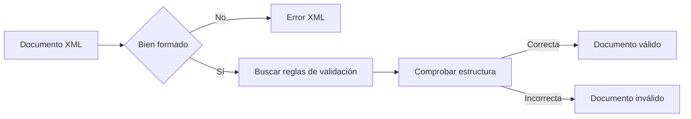

# 1. Introducción a la validación XML

En la unidad anterior aprendiste a crear documentos XML bien formados, es decir, documentos que respetan las reglas sintácticas del lenguaje: etiquetas correctamente anidadas, un único elemento raíz y una estructura coherente.

Sin embargo, cuando varias aplicaciones intercambian información, no basta con que un documento XML esté bien escrito. También es necesario garantizar que contiene los elementos adecuados y que estos aparecen en el orden esperado.

La validación permite comprobar que un documento XML cumple unas reglas previamente definidas.

---

## 1.1 Bien formado no significa válido

Observa el siguiente ejemplo:

```xml
<?xml version="1.0" encoding="UTF-8"?>

<libro>
    <precio>29.95</precio>
</libro>
```

Este documento XML está correctamente escrito.

- Tiene un único elemento raíz.
- Las etiquetas están correctamente cerradas.
- La sintaxis es correcta.

Por tanto, es un documento **bien formado**.

Sin embargo, imaginemos que una aplicación espera que todos los libros tengan un título y un autor.

En ese caso, el documento anterior no sería correcto para esa aplicación.

!!! note "Idea clave"

    Un documento XML puede estar bien formado y aun así contener una estructura incorrecta para el uso que se le quiere dar.

---

## 1.2 ¿Qué significa validar un documento XML?

Validar consiste en comprobar que un documento XML sigue un conjunto de reglas previamente definidas.

Estas reglas pueden especificar:

- Qué elementos pueden aparecer.
- En qué orden deben hacerlo.
- Cuántas veces pueden repetirse.
- Qué atributos puede tener cada elemento.

Por ejemplo:

```xml
<libro>
    <titulo>XML desde cero</titulo>
    <autor>Ana García</autor>
</libro>
```

Si las reglas establecen que todo libro debe contener un título y un autor, este documento será válido.

---

## 1.3 Documento bien formado vs documento válido

Aunque a menudo se confunden, son conceptos diferentes.

| Documento | Descripción |
|------------|------------|
| Bien formado | Cumple las reglas sintácticas de XML. |
| Válido | Está bien formado y además cumple las reglas definidas por un esquema. |

!!! warning "Importante"

    Todo documento válido es necesariamente bien formado.

    Pero no todo documento bien formado es válido.

---

## 1.4 El proceso de validación

Cuando un programa analiza un documento XML suele seguir una secuencia similar a la siguiente:



La validación permite detectar errores antes de que la información sea procesada por otras aplicaciones.

---

## 1.5 ¿Qué es una DTD?

DTD significa **Document Type Definition**.

Una DTD describe la estructura que debe tener un documento XML.

Gracias a ella podemos definir:

- Los elementos permitidos.
- La relación entre dichos elementos.
- Los atributos que pueden utilizarse.
- Restricciones básicas sobre el contenido.

Durante muchos años fue el mecanismo estándar para validar documentos XML.

!!! info "En esta unidad"

    Aprenderás a crear DTD internas y externas, definir elementos y atributos, y validar documentos XML completos.

---

## 1.6 ¿Por qué aprender DTD hoy?

Actualmente existen sistemas más avanzados, como XML Schema (XSD), que estudiaremos en la siguiente unidad.

Aun así, conocer DTD sigue siendo importante porque:

- Introduce los conceptos fundamentales de validación.
- Permite comprender la evolución de XML.
- Todavía aparece en numerosos estándares y aplicaciones.

Además, aprender DTD facilita enormemente el aprendizaje posterior de XSD.

---

## Actividad de reflexión

!!! question "Piensa"

    Observa el siguiente documento XML:

    ```xml
    <alumno>
        <nombre>Carlos</nombre>
    </alumno>
    ```

    ¿Puedes asegurar que contiene toda la información necesaria para representar un alumno?

    ¿Qué elementos añadirías?

??? tip "Posible respuesta"

    No podemos saberlo únicamente observando el documento.

    Necesitaríamos conocer las reglas que debe cumplir la estructura.

    Por ejemplo:

    - Apellidos.
    - Correo electrónico.
    - Curso.
    - Grupo.

    Esa información podría definirse mediante una DTD.

---

!!! tip "Al terminar este apartado"

    Deberías comprender la diferencia entre un documento XML bien formado y un documento XML válido, así como la necesidad de utilizar mecanismos de validación.
